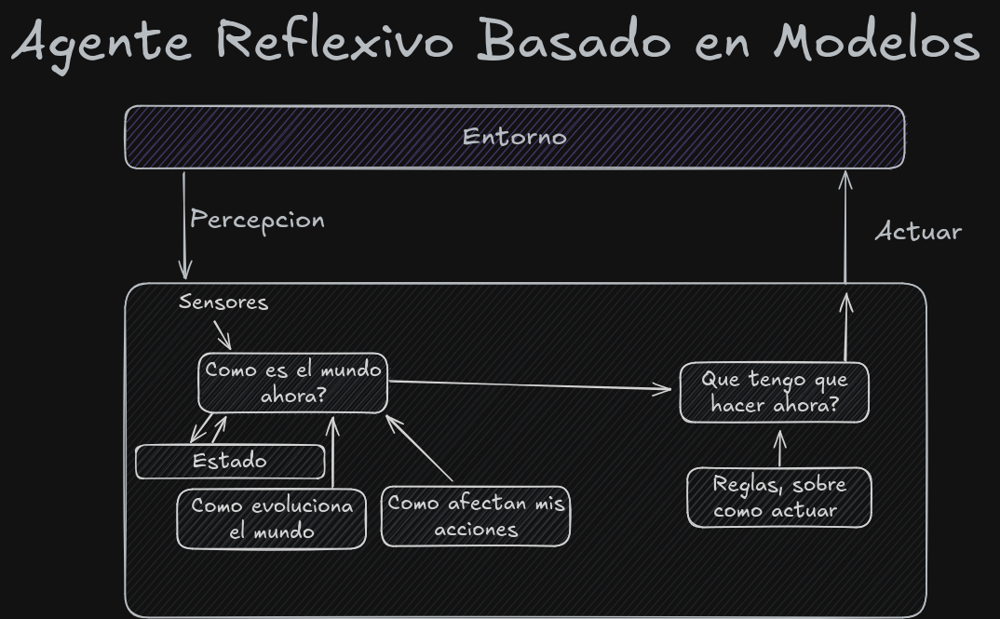

# Projecto Piedra, Papel, Tijera | MIA

### Información

Este projecto esta hecho por el alumno, **Yeison Gonzalez Rascado**.

### ¿En que consiste el projecto?

En este projecto se propone la creación de agente inteligente para solucionar tareas en un entorno del juego
de **piedra, papel o tijera**.

### Especificación del entorno de tareas

#### Observable

El RPS es **Parcialmente Observable** , ya que en el momento de jugar ninguno de los jugadores conoce la opcion que a elegido el oponente, aun cada uno de manera individual si sabe todos los posibles resultados.

#### Agentes

En este entorno se usan 2 agentes por lo cual se clasifica como **Multiagente** , ya que esta hecho para que dos agentes jueguen entre si al piedra papel o tijera. 

#### Determinista

El juego de piedra, papel o tijera es **No Determinista**, ya que ningún jugador puede predecir con absoluta certeza cuál será la elección de su oponente.

#### Episodico | Secuencial

Mi idea es desarrollar un agente basado en modelos que sea capaz de almacenar partidas previas y, en función de estas, seleccionar la mejor opción. Por lo tanto, este enfoque lo clasifica como un modelo **Secuencial**.

#### Entorno

El juego tiene un entorno **Estático**, ya que este no cambia mientras ningunos de los agentes estan calculando la jugada que van a hacer.

#### Discreto | Continuo

Ya que las opciones del piedra, papel o tijera son finitas y se conocen todos el juego se clasifica como **Discreto**

#### Conocido | Desconocido

Es un juego **Conocido**, ya que los agentes que juegan conocen y entienden las reglas.

| Entorno de tareas  | Observable  | Axentes     | Determinista  | Episódico  | Estático  | Discreto  | Coñecido  |
|---|---|-------------|---|---|---|---|---|
|  RPS | Parcialmente Observable  | Multiagente | No Determinista  |  Secuencial | Estático  | Discreto  | Conocido  |

### Identificación del tipo de agente y su estructura

Para la creación del agente decidí optar por un **agente basado en modelos**, ya que permite que el agente pueda aprender mediante el *Estado*, la capacidad de poder almacenar las partidas anteriores, y así poder desarrollar un algoritmo para que el agente juegue mejor al RPS y sea capaz de ganar el mayor número posible de partidas.

</img>

#### Componetes del Agente

1. **Como es el mundo ahora**: Esta parte se encarga de crear una representacion del mundo gracias a las **percepciones**,**estado interno** y el **conocimiento de las reglas**.
2. **Estado**: Esta es la parte crucial del agente, es la encargada en almacenar un historico de todas las partidas o **percepciones** del entorno, es como si fuese la **memoria** del agente, esto es lo que le permitira aprender del mundo ya puede alamacenar partes del mundo que antes no podian ver.
3. **Como evoluciona el mundo**: Se encarga de describir como cambian las condiciones del entorno con el tiempo, basandose en el **estado**.
4. **Como afectan mis acciones**: Esto se basa en porder evaluar las consecuencias de las acciones que que a echo, almacenadas en el **estado**, para obtaner un grado de un buen o mal desenpeño en el juego.